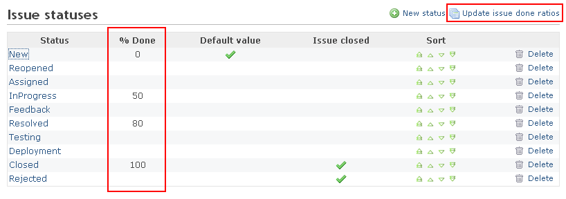
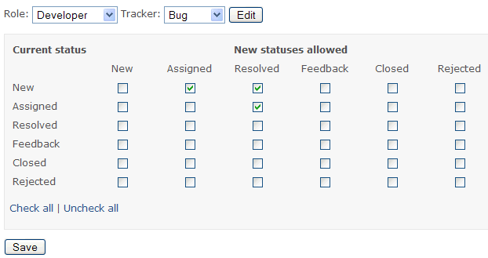

課題管理システム
================

!!! note ""
    最終更新: 2010/10/30

[TOC]

トラッカー {: #Trackers }
----------

トラッカーは、異なる種類のチケットを分類するものです。トラッカーごとに以下のものを定義できます。

-   そのトラッカーのチケットをロードマップに表示するかどうか
-   ワークフロー

新しいトラッカーを作成したら、そのトラッカーを利用するためにワークフローを定義する必要があります。新しくトラッカーを作成する際に、既存のトラッカーのワークフローをコピーすることもできます(「新しいトラッカーを作成」画面の「ワークフローをここからコピー」ドロップダウンリストでワークフローのコピー元となるトラッカーを選択してください)。

チケットのステータス
--------------------

チケットのステータスは自由に追加・削除できます。それぞれのステータスには以下の二つの設定があります。

-   **終了したチケット**: そのステータスは、チケットが終了した状態であることを示します (複数のステータスを「終了したチケット」として定義できます)
-   **デフォルト値**: 新しいチケットを作成したときに選択されるデフォルトのステータスです (一つのステータスのみを「デフォルトのステータス」として定義できます)

### 進捗%

このオプション(およびチケットのステータス画面における一覧表内の列)は「管理」→「設定」→「チケットトラッキング」で [進捗の算出方法](RedmineSettings.md#Calculate-the-issue-done-ratio) が 「チケットのステータスを使用する」に設定されている場合に限り利用可能です。

この項目が空白の場合、チケットのステータスを変更しても進捗%が更新されません。

### 進捗の更新

このコマンドは [進捗の算出方法](RedmineSettings.md#Calculate-the-issue-done-ratio) が 「チケットのステータスを使用する」に設定されている場合に限り利用可能です。実行すると、すべてのチケットの進捗%の値がそのチケットのステータスに対応したものに更新されます。

ワークフロー
------------

ワークフローは、プロジェクトのメンバーに対してどのようにチケットのステータスを遷移することができるのかを定義するものです。

ワークフローの設定画面で、ワークフローを編集したいロールとトラッカーの組み合わせを選択し、「編集」ボタンをクリックしてください。選択したロールとトラッカーの組み合わせに対してどのようなステータス遷移を許可するのか設定できる画面が表示されます。「現在のステータス」は、ステータスの初期状態を示します。「ステータスの移行先」は、それぞれの初期状態から遷移できるステータスです。

!!! note
    ユーザーがチケットのステータスを更新するには「チケットの編集」権限か「注記の追加」権限が必要です。

上図の例では、ステータスが「New」である「Bug」トラッカーのチケットは、「Developer」ロールでは「Assigned」または「Resolved」に変更できます。ステータスが「Assigned」であるものは「Resolved」に変更できます。ステータスが「New」「Assigned」のいずれでもないものは、「Developer」ロールではステータスを変更することはできません。
