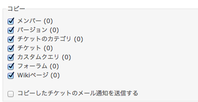

プロジェクトの管理操作
======================

!!! note ""
    最終更新: 2017/08/30 [[原文](http://www.redmine.org/projects/redmine/wiki/RedmineProjects/20)]

[TOC]

プロジェクト一覧
----------------

プロジェクトの一覧には、デフォルトではすべての有効（アクティブ）なプロジェクトが表示されます。アーカイブされたプロジェクトも含むすべてのプロジェクトの一覧を表示するには、「フィルタ」内の「ステータス」を「すべて」に切り替えてください。

なお、プロジェクトの一覧としては、通常のユーザーでもトップメニュー内の「プロジェクト」をクリックすると表示されるものもあります。この画面では、システム管理者ではないユーザーでも新しいプロジェクトを作成できます（また、プロジェクトの終了操作もプロジェクト内で行えます）。しかし、「管理」→「プロジェクト」で表示されるプロジェクトの一覧で行える、本ページで説明する管理操作は行えません。ユーザーに付与されている権限によっては、ここで説明するプロジェクト一覧がプロジェクトの管理操作を行う唯一の場所です。

-   **プロジェクト:** プロジェクトの名称です
-   **説明:** プロジェクトの端的な説明です
-   **公開:** アイコン「」が表示されているプロジェクトは公開プロジェクトで、誰もがこのプロジェクトを見ることができます。また、[「非メンバー」および「匿名ユーザー」ロール](RedmineRoles#System-roles)に対して付与された権限の範囲内の操作が行えます。非公開プロジェクトの場合は、システム管理者がそのプロジェクトへのアクセス許可を与えているユーザーのみがアクセスできます
-   **作成日:** そのプロジェクトが作成された日付です

プロジェクトの追加・編集
------------------------

[プロジェクトの設定](RedmineProjectSettings) を参照してください。

プロジェクトの終了
------------------

プロジェクトの「終了」の操作を行うと、プロジェクトが読み取り専用になります。終了した後も通常のプロジェクト同様にアクセスできますが、更新操作は一切行えません。

プロジェクトを終了させるためのリンクは各プロジェクトの[「概要」画面](RedmineProjectOverview)にあります。「管理」→「プロジェクト」画面にはないので注意してください。

アーカイブ
----------

アイコン「」をクリックしてください。

アーカイブされたプロジェクトはユーザーからは見えなくなります。システム管理者がアーカイブ解除すれば元通りにアクセスできるようになります。プロジェクトをアーカイブすると、そのプロジェクトのサブプロジェクトも一緒にアーカイブされます。

既存プロジェクトのコピー
------------------------

プロジェクト一覧で、コピー元プロジェクトの行の右側にあるアイコン「」をクリックしてください。

コピー先プロジェクトの設定画面が表示されます。この画面ではあらかじめコピー元と同じ設定（チケット、トラッカー、カスタムクエリ等）が選択済みです。画面の下部では、コピー先にどのデータを引き継ぐのか選択できます。

プロジェクトの削除
------------------

プロジェクトの一覧で「」をクリックしてください。本当に削除してよいのか、確認画面が表示されます。

この操作は、指定されたプロジェクトとそのすべてのサブプロジェクトを物理的に削除します。「アーカイブ」とは異なり、削除したプロジェクトは元には戻せません。特に注意しながら操作してください。
