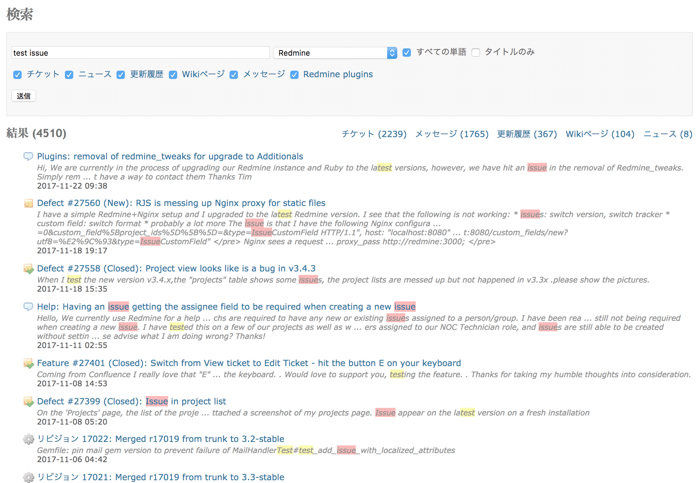

検索
====

!!! note ""
    最終更新: 2017/11/24
    [[原文](http://www.redmine.org/projects/redmine/wiki/RedmineSearch/7)]

[TOC]

検索ボックス
------------

Redmineの画面右上に検索ボックスがあります。キーワードを入力してEnterキーを押すと検索が行えます。

検索キーワードにチケットの番号(例: \#999 または 999)を指定すると、そのチケットの画面に遷移します。検索キーワードはダブルクォーテーションで囲むこともできます。

ドロップダウンメニューには現在のプロジェクトが表示されます。検索機能では、現在のプロジェクトの情報の全文検索を行います。

検索ボックス左側の **検索** をクリックすると、詳細検索画面に移動します。この画面には、検索対象のプロジェクトを選択のためのドロップダウンメニューと、検索対象の情報を選択するためのチェックボックスがあります。チェックボックスは、そのプロジェクトで有効にしているモジュールについてのみ表示されます。

検索の設定
----------

### タイトルのみ

詳細検索画面で **タイトルのみ** を有効にすると検索結果を限定することができます。

### カスタムフィールドの検索 {: #Search-custom-fields }

カスタムフィールドはデフォルトでは検索対象ではありません。検索対象に含めたい場合は、カスタムフィールドの設定画面で **検索対象** のチェックボックスを有効にしてください。

### 検索結果

以下のスクリーンショットは "test issue" というキーワードで[Redmine公式サイト](http://www.redmine.org/)を検索してみた様子です。

* 多数の検索でヒットした情報へのリンク
* 検索キーワードのハイライト表示
* オブジェクトの種類ごとの検索結果へのリンク（例: News）
* 検索結果の種類を示すアイコン （例: チェンジセット、チケット、フォーラムのコメント）

Search controller
-----------------

検査機能の動作の詳細を把握するには、以下のソースコードを見てください。

[trunk/app/controllers/search_controller.rb](http://www.redmine.org/projects/redmine/repository/entry/trunk/app/controllers/search_controller.rb)

ソースコードを確認すると次のような検索機能の挙動も把握できますす。

-   検索には最初の5個までのキーワードが使われます。
-   キーワードは2文字以上である必要があります。
-   検索結果は10件ごとにページを分けて表示されます。
